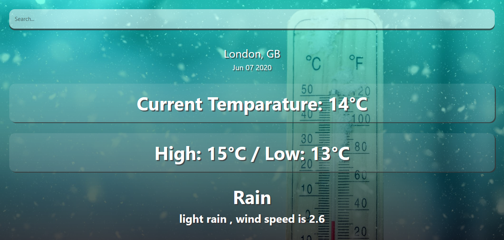
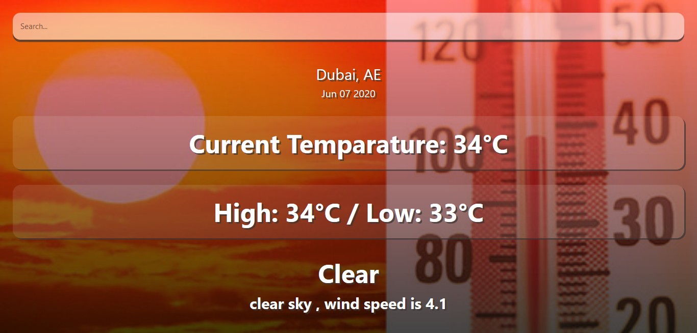

# react_Weather_App
(trining on react js) this is the source code of react Weather App project

the project allow us to search (cities and countries) to view weather information

I'm using open weather map api to get weather info and geolocation-db.com to get current city name

the basic idea is taken from this article https://dev.to/kgprajwal/learn-react-by-building-a-weather-app-3229 and I updated the basic code by adding the current location functionality when the app starts

sample 1

sample 2

